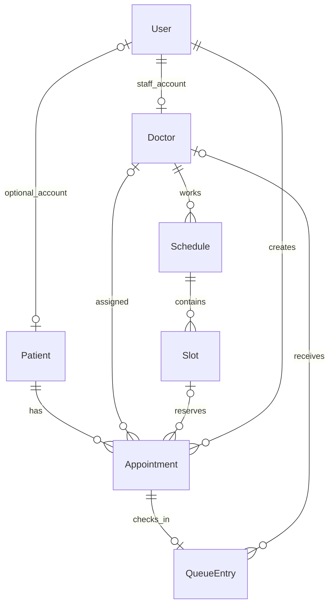

# Receptionist data models

This addition uses the existing CommonJS backend, Mongoose 7, User model, and Express error handler. It adds no endpoints, authentication changes, seed data, or database migrations. The User role enum now also accepts receptionist; patient remains the default.

## Relationships



- Patient: demographics and optional account/NIC. No account is needed for a walk-in; a child can have no NIC. Phone may be a guardian's number.
- Doctor: references the existing doctor User; does not duplicate credentials.
- Schedule: one doctor's department, room, start/end instants and status.
- Slot: an interval within a schedule, capacity 1–100 and availability.
- Appointment: patient, optional doctor/slot, local visit date, status and creator User. source is explicitly required and immutable: online or walk_in. Online requires both doctor and slot; walk-ins may await assignment.
- QueueEntry: one entry per appointment; optional assigned doctor, department, daily numeric token, priority, status and check-in/call/completion timestamps. Patient details and appointment source are read through the appointment reference.

Date/time instants use MongoDB Date (UTC). visitDate and queueDate are real YYYY-MM-DD dates in Asia/Colombo. Queue token uniqueness is per department per day in the current single-hospital backend; a token such as OPD-035 is presentation formatting.

## Validation integration

Schema validators run on document validation/save. Use the helper below for reference existence, account roles, doctor/slot consistency, schedule bounds and local dates. It reads related records but does not write anything.

```js
const {
  validateReceptionistDocument,
  forwardReceptionistError,
} = require('../validation/receptionistValidation');

// Inside a future controller, after existing auth and field allowlisting:
try {
  // For edits, load the existing document and assign only permitted fields.
  // createdBy comes from req.user._id, never a client-supplied actor.
  await validateReceptionistDocument(document);
  await document.save();
} catch (error) {
  return forwardReceptionistError(error, res, next);
}
```

The error adapter sets 400 for validation/cast/unknown-field errors and 409 for duplicate keys, then calls next(error). The existing utils/errorHandler.js remains unchanged. Other errors pass through unchanged. No route is wired to these helpers yet.

Use loaded documents and save() for multi-field edits: raw update queries do not provide the complete document context needed for interval and conditional-field checks. Do not use this validation helper as authorization; existing auth and future route-level access checks still apply.

## Validation tests

From the repository root in PowerShell:

```powershell
cd backend
npm.cmd ci
node --test test/receptionistValidation.test.js
```

Tests run real Mongoose document validators without MongoDB. Cross-document tests inject in-memory lookup records; error-adapter tests invoke the existing error handler. There are no new dependencies.

## Boundaries for the next workflow layer

- Mongoose references are not foreign keys: call validateReceptionistDocument before writes; schema validation alone does not check reference existence.
- Unique indexes are declared, but duplicate enforcement needs real MongoDB index creation and integration tests. Initialize indexes before accepting writes.
- Capacity reservations, overlapping shifts/slots, duplicate active bookings, token generation, status transitions and simultaneous booking/dispatch are service-level operations. They are not implemented or guaranteed by these schemas. Use atomic operations/transactions when adding those endpoints; reference reads alone cannot prevent races.
- Completed/archived records can remain linked to an inactive doctor. New appointments cannot book inactive doctors, blocked slots or cancelled schedules.
- This phase has no patient app, doctor app, login changes, medical notes, SMS or printing.
